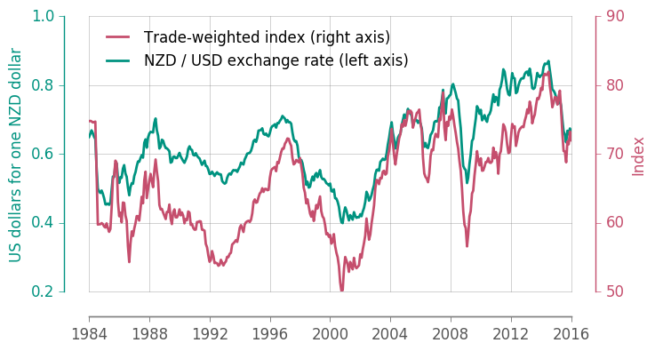

# Dualplot libraty

Create a `matplotlib` figure with dual y-axis using the style by:

https://www.r-bloggers.com/dual-axes-time-series-plots-may-be-ok-sometimes-after-all/?utm_source=feedburner&utm_medium=feed&utm_campaign=Feed%3A+RBloggers+%28R+bloggers%29

## Installation

Commit from `github`

```
# pip install .
```

## Usage

Import the module `dualplot` and additional modules required. The module contains the ``DualPlot`` class, which allows to create ``matplotlib`` graphs with two axes.


```python
import dualplot
import pandas as pd
%matplotlib inline
import matplotlib.pyplot as plt
plt.rcParams['grid.linestyle'] = '-'
plt.rcParams['grid.alpha'] = 0.5
```

The excell file containing the data to plot is loaded using ``pandas``:


```python
change = pd.read_excel('http://www.rbnz.govt.nz/-/media/ReserveBank/Files/Statistics/Key%20graphs/graphdata.xlsx', sheetname="8_NZDUSD", skiprows=4,
                      parse_cols=[1, 2, 3])
```

The column ``DATE`` is converted from ``1984M1`` to date format:


```python
change['DATE'] = pd.to_datetime(change['DATE'], format='%YM%m')
```


```python
change.head()
```


<div>
<table border="1" class="dataframe">
  <thead>
    <tr style="text-align: right;">
      <th></th>
      <th>DATE</th>
      <th>R$USD</th>
      <th>RTWI</th>
    </tr>
  </thead>
  <tbody>
    <tr>
      <th>0</th>
      <td>1984-01-01</td>
      <td>0.6489</td>
      <td>74.74</td>
    </tr>
    <tr>
      <th>1</th>
      <td>1984-02-01</td>
      <td>0.6582</td>
      <td>74.79</td>
    </tr>
    <tr>
      <th>2</th>
      <td>1984-03-01</td>
      <td>0.6682</td>
      <td>74.71</td>
    </tr>
    <tr>
      <th>3</th>
      <td>1984-04-01</td>
      <td>0.6600</td>
      <td>74.56</td>
    </tr>
    <tr>
      <th>4</th>
      <td>1984-05-01</td>
      <td>0.6496</td>
      <td>74.61</td>
    </tr>
  </tbody>
</table>
</div>


Finally the ``DualPlot`` class is used to plot change rate from New Zealand dollars to US dollars and the trade-weighted index:


```python
# create the dual plot object
dp = dualplot.DualPlot(figsize=(7, 4))
# plot data on the left axis
dp.plot_left(change['DATE'], change['R$USD'], 
             label="NZD / USD exchange rate (left axis)")
# plot data on the right axis
dp.plot_right(change['DATE'], change['RTWI'], 
              label="Trade-weighted index (right axis)")
# set range of the x axis
dp.axleft.set_xlim(['1984-01-01', '2016-01-01'])
# add legend
dp.legend(frameon=False)
# add labels
dp.set_ylabel_left('US dollars for one NZD dollar')
dp.set_ylabel_right('Index')
# set the number of major ticks
dp.axleft.locator_params(axis='y', nbins=4)
dp.axright.locator_params(axis='y', nbins=4)
```




